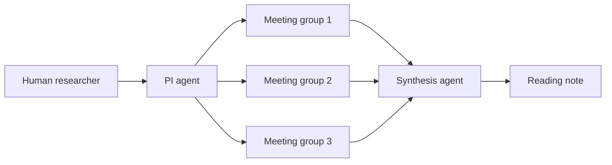

# Paper Readar

A small multi-agent paper reading lab inspired by the Virtual Lab architecture.

The first version focuses on a tight feedback loop for reading papers:

- A PI agent frames the research question and coordinates meetings.
- Several scientist agents inspect the paper from different angles.
- Multiple independent meetings run in parallel to encourage diverse takes.
- A synthesis agent merges the best points into a structured reading note.

The project runs in `mock` mode by default, so you can inspect and extend the architecture without setting up an API key. When you are ready, switch to any OpenAI-compatible chat completions endpoint.

## Quick Start

Install dependencies:

```powershell
python -m pip install -e .
```

```powershell
python -m paper_lab --paper examples/virtual_lab_note.md --question "How does the multi-agent architecture work?"
```

If your Windows shell does not expose `python`, use the full Python executable path or the Python launcher configured on your machine.

Write the result to a file:

```powershell
python -m paper_lab --paper examples/virtual_lab_note.md --output outputs/virtual_lab_reading_note.md
```

Run a PDF paper directly:

```powershell
python -m paper_lab --paper "paper/Can AI Agents Synthesize Scientific Conclusions.pdf" --parallel-meetings 2 --output outputs/can_ai_agents_reading_note.md
```

PDF runs default to the first `20000` extracted characters to keep early experiments cheaper and avoid token-per-minute limits. Use `--max-paper-chars 0` only when you intentionally want to send the full extracted text to every agent.

Run the zero-dependency test suite:

```powershell
python -m unittest discover -s tests
```

Use OpenAI Responses API:

```powershell
Copy-Item .env.example .env
# Edit .env and set OPENAI_API_KEY to a fresh key.
python -m paper_lab --paper path/to/paper.txt --parallel-meetings 3
```

Optional endpoint override:

```powershell
$env:PAPER_LAB_BASE_URL="https://api.openai.com/v1"
```

The real provider uses `POST /v1/responses`. Keep `.env` private; it is ignored by git.

## Architecture



Scientist roles:

- `Structure Analyst`: decomposes the paper into claims, methods, evidence, and assumptions.
- `Critic`: challenges weak links, missing controls, vague definitions, and overclaims.
- `Literature Connector`: proposes adjacent work, keywords, and follow-up search directions.
- `Application Strategist`: turns the reading into experiments, implementation ideas, and reusable patterns.

## Why This Shape

This mirrors the core Virtual Lab idea without requiring a heavy agent framework. The useful part to practice is not tool count, but role separation, meeting orchestration, parallel diversity, and final low-temperature synthesis.

## Next Steps

- Add a retrieval tool for related papers.
- Persist agent transcripts as JSON for later analysis.
- Add a small web UI for paper uploads and reading-note browsing.
